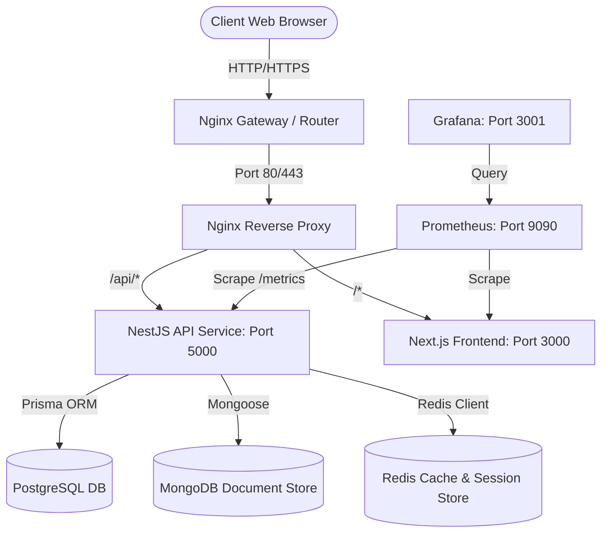

# System Architecture

This document defines the high-level architecture and platform layout for the enterprise Portfolio Platform.

## Platform Topology

The platform is designed as a set of decoupled, independently deployable services sitting behind an Nginx reverse proxy.

## System Components

### 1. Reverse Proxy & Gateway (Nginx)
* **Responsibility**: SSL termination, routing HTTP traffic, load balancing, static file caching.
* **Ports**:
  * External: `80` (HTTP), `443` (HTTPS)
  * Internal upstream routing: `3000` (Next.js), `5000` (NestJS)

### 2. Frontend Application (Next.js 15 App Router + React 19)
* **Responsibility**: UI layer, static/dynamic site generation (SSG/ISR), interactive canvas elements, client state management (Zustand), and feature-sliced module architecture.
* **Environment**: Runs node server on port `3000` internally.
* **Module Architecture**:
  * `src/app/`: App Router route pages (`/`, `/about`, `/projects`, `/projects/[slug]`, `/experience`, `/resume`, `/contact`).
  * `src/features/`: Domain-driven feature packages (`portfolio`, `projects`, `about`, `experience`, `resume`, `contact`, plus future-ready `blog`, `resources`, `courses`, `labs`, `admin`).
  * `src/components/`: Reusable UI primitives (`ui/`) and common layouts (`common/`).
  * `src/store/`: Zustand stores (`useUIStore.ts`).
  * `src/types/` & `src/data/`: Strongly typed entity schemas and mock datasets.

### 3. Backend API (NestJS)
* **Responsibility**: REST endpoints, business logic, analytics ingestion, authentication, database migrations.
* **Environment**: Runs node server on port `5000` internally.

### 4. Relational Database (PostgreSQL)
* **Responsibility**: Master transactional database storing structured data such as users, projects, works, experiences, and configuration.
* **Access**: Prisma Client.

### 5. Document Database (MongoDB)
* **Responsibility**: Semi-structured log storage, blog post documents, complex analytics event streams.
* **Access**: Mongoose.

### 6. Caching & Message Store (Redis)
* **Responsibility**: API response caching, authentication session token blacklisting, rate limiting.

### 7. Monitoring & Observability (Prometheus & Grafana)
* **Responsibility**: Scraping node metrics, visualization of request counts, system resource usage, latency distributions.
