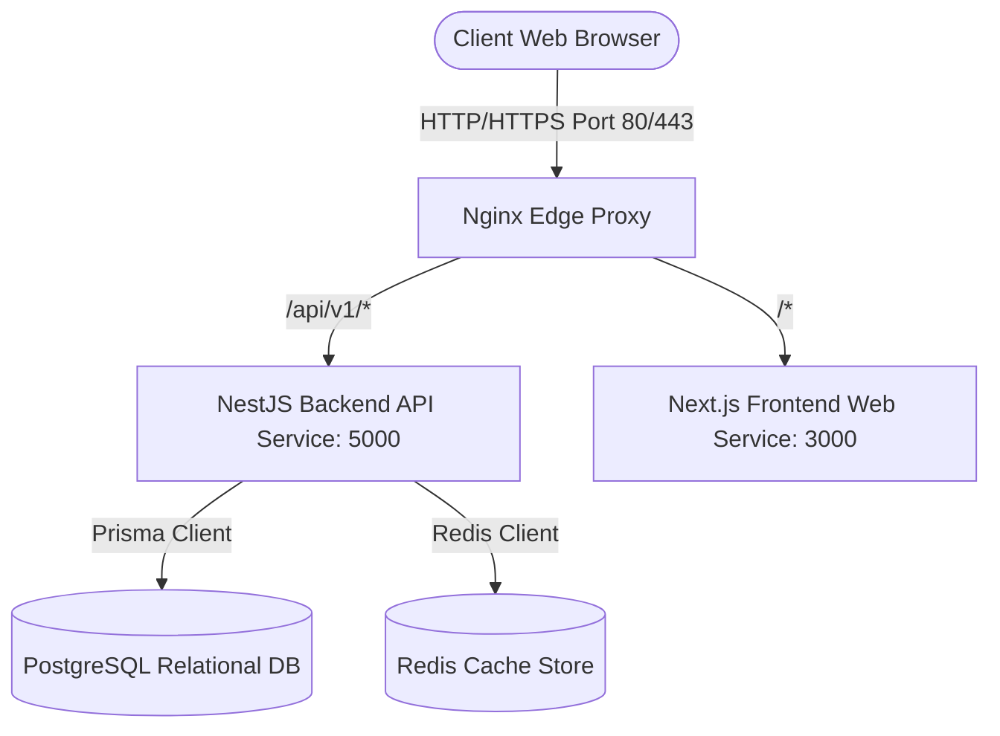
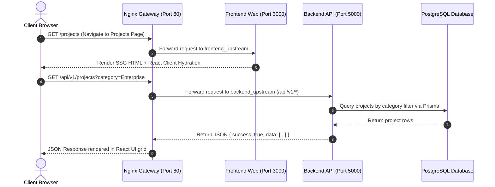
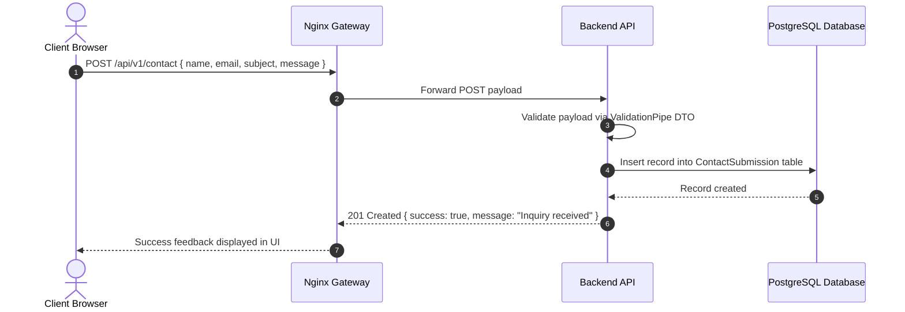

# System Design & Architecture Overview

This document provides system design architecture diagrams and sequence flows for the Portfolio Platform.

## High-Level System Topology

## Phase 1 Sequence Flow: Client Data Fetching & Gateway Routing

## Phase 1 Sequence Flow: Contact Inquiry Submission

