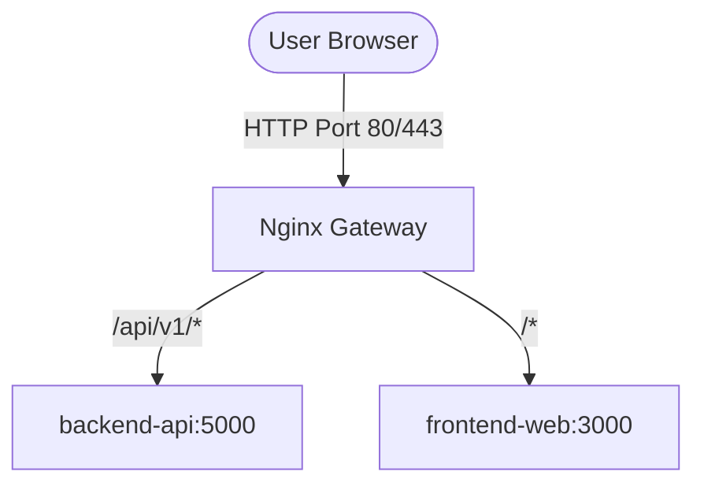

# Infrastructure & DevOps Architecture

This document defines the reverse proxy gateway, container orchestration, monitoring pipelines, and CI/CD deployment architecture (`infra`).

## Proxy & Gateway Topology (Nginx)
Nginx acts as the single entry point for incoming HTTP/HTTPS traffic, routing requests based on path prefixes:

## Container Orchestration (Docker Compose)
The development and staging stacks are managed via `infra/docker/docker-compose.yml`:
* `nginx`: Gateway proxy exposing port 80/443.
* `frontend-web`: Next.js web application container (internal port 3000).
* `backend-api`: NestJS REST API container (internal port 5000).
* `postgres`: PostgreSQL 16 relational database container (internal port 5432).
* `mongodb`: MongoDB 7 document store container (internal port 27017).
* `redis`: Redis 7 transient caching container (internal port 6379).
* `prometheus` & `grafana`: Monitoring and metrics visualization stack (ports 9090 & 3001).

## Routing Specifications (`infra/nginx/conf.d/default.conf`)
* `/api/v1/*` -> `http://backend-api:5000`
* `/health` -> `http://backend-api:5000/health`
* `/*` -> `http://frontend-web:3000`
